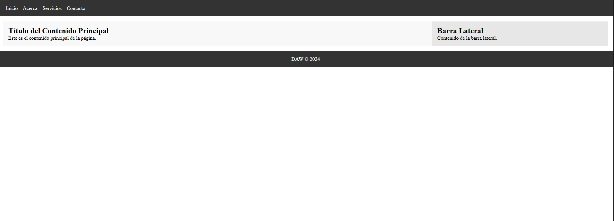

# Reto2.8

Nombre y Apellidos: Pablo Rodríguez Crespo
URL del repositorio de gitlab: https://github.com/Pablosax9/ODAW2_RETO.2.8_flexbox2.git

## Enunciado

Crea una página web que contenga una barra de navegación horizontal en la parte superior, un pie de página en la parte inferior, y un área de contenido principal que tenga una sección principal y una barra lateral. Utiliza Flexbox para hacer que la barra lateral esté siempre a la derecha de la sección principal y para que la barra de navegación y el pie de página se extiendan a lo largo del ancho de la ventana del navegador.

